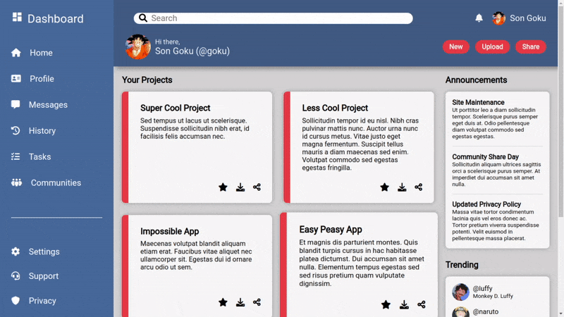
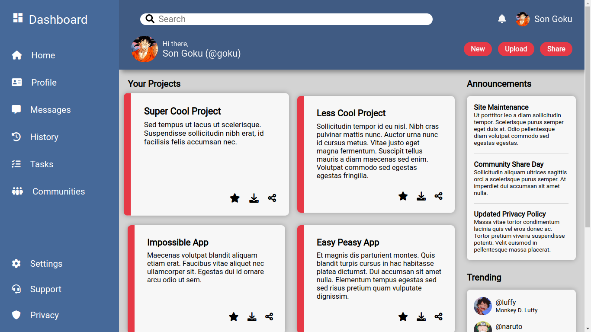
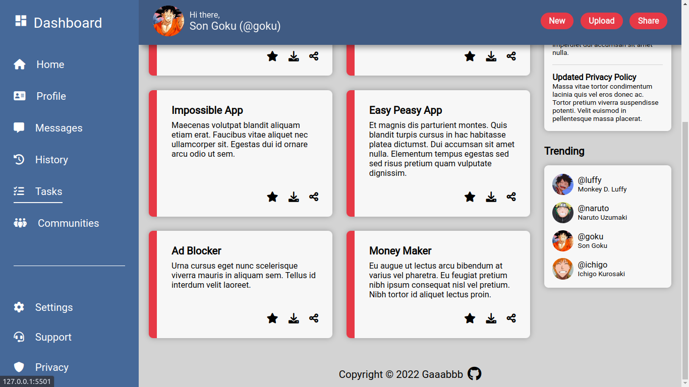

<h1 align="center">Admin Dashboard</h1>
<h3 align="center"><a href="https://gaaabbb.github.io/admin-dashboard/">:film_projector: Live Demo</a></h3>

## :scroll: Description
This project, which was created as part of TheOdinProject's Intermediate HTML and CSS Course, is a non-functional Admin Dashboard where the assignment is to practice my skills on using grid and flexbox. The design layout is based on the provided design reference in the assignment.

## :pencil2: Features
* Responsive grid layout and able to adjust size according to screen size.
* Collapsible sidebar for smaller screens.
* Animations for specific elements.
* Responsive design and adjusts well with mobile devices.

## :framed_picture: Gallery
#### Page Up

#### Page Down

## :computer: Languages Used
* HTML
* CSS
* JavaScript

## :copyright: Credits
### Note
*I don't own any of the the pictures and fonts used in this website. The rights for the materials I used belong to the respective authors, aritsts, and publishers.*